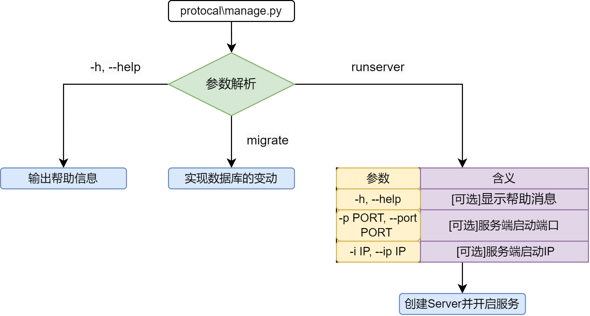
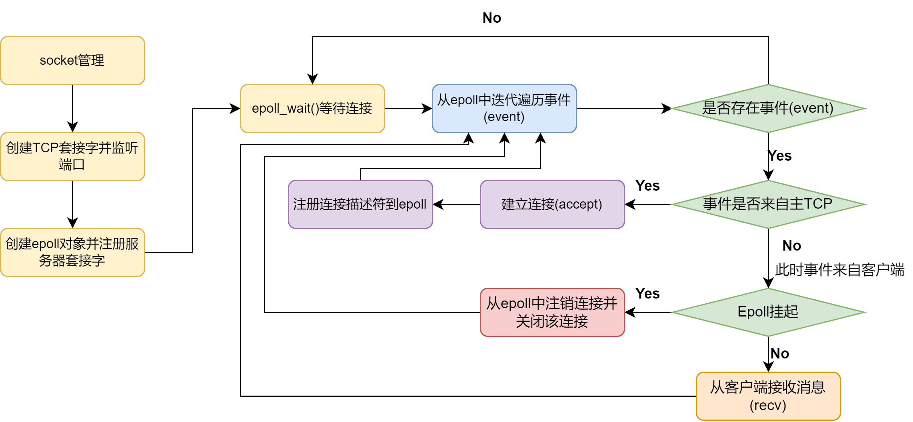

# MuuD Web框架

	在毕业设计的时候，初始选题为《基于XMPP的即时通讯系统》，想的是自己照着RFC写一遍XMPP协议，但是时间不够（毕竟要上班）。所以把废案再利用，抽出其中的一些部分，**从Socket到web框架**，实现一个简单的CURD功能，锻炼一下自己的文档化编程能力。受我个人能力有限会随时断更，一路上只有vscode和chatGPT以及所需要的RFC文档。

## 目录结构

```
├── config
│   ├── client.conf
│   ├── database.conf        
│   ├── server.conf
│   ├── server.crt
│   ├── server.csr
│   └── server.key
├── manage.py
├── README.md
├── requirements.txt
├── rprint.py
├── server
│   ├── db.py
│   ├── models.py     
│   ├── serialization.py
│   ├── server.py
│   ├── urls.py
│   ├── utils
│   │   ├── autoreload.py
│   │   ├── epollcontrol.py
│   │   ├── functional.py
│   └── views.py
└── test
```

- **config**

  包含数据库配置(`database.conf`)，SSL使用的证书(`server.csr`)和key(`server.key`)，socket服务配置(`server.conf`)

- **utils**

  一些帮助模块

- **server**

  主要功能实现，包括路由、epoll管理、数据库相关，其中`views.py`可以编写api，`urls.py`中设置路由

- **test**

  一些测试用例

## 运行

1. 安装依赖库

   `pip install -r requirements.txt `

2. 数据库迁移

   `python3 manage.py migrate`

   可以使用`python3 manage.py --help`查看更多用法

3. 运行服务

   `python3 manage.py runserver`

   可以使用`python3 manage.py --help`查看更多用法


## 核心构架

**服务端启动**



**epoll过程**



**epoll原理**


